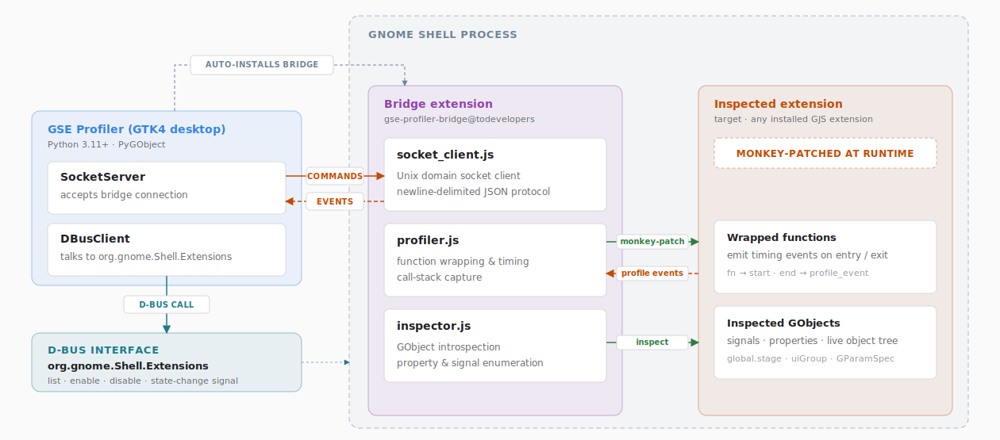

<p align="center">
  
</p>

# GSE Profiler

[](https://github.com/todevelopers/gse-profiler/actions/workflows/ci.yml)
[](https://github.com/todevelopers/gse-profiler/releases/latest)
[](LICENSE)
[](https://ko-fi.com/tommygunx89)

An all-in-one developer toolkit for GNOME Shell extension authors — built as a native
GTK4 / libadwaita app that fits right into your desktop.

GSE Profiler installs a lightweight bridge extension inside the running shell process and instruments
your extension at runtime, with **zero changes to your code**. Profile function timing and
visualise it as a **flamegraph** (call tree and timing), **swimlane** (when and how often each function runs), or **histogram** (where time is actually spent). Filter and search live logs
scoped to a single extension UUID. Inspect the live state of any running extension object:
browse properties, see current values, and drill into nested objects on the fly.

---

## Features

| Feature               | Description                                                                                                                                                 |
| --------------------- | ----------------------------------------------------------------------------------------------------------------------------------------------------------- |
| **Extension Manager** | Browse all installed extensions with status, enable/disable with one click, open the source folder directly                                                 |
| **Log Viewer**        | Live `journalctl` stream scoped to a single extension UUID; filter by log level and search full-text in real time                                           |
| **Profiler**          | Monkey-patch any extension at runtime. No code changes needed. Visualise timing as a flamegraph, swimlane, or histogram; export and reload sessions as JSON |
| **Inspector**         | Inspect a live extension object: browse its properties and methods, see current values, and call methods interactively                                      |

---

## How It Works

<p align="center">
  <picture>
    <source media="(prefers-color-scheme: dark)" srcset="docs/architecture-dark.svg">
    
  </picture>
</p>

GSE Profiler is split into two parts: a **GTK4 app** (Python) and a **bridge GJS extension**
(`gse-profiler-bridge@todevelopers`) that the app auto-installs on first launch. The bridge
runs inside the `gnome-shell` process itself — giving it direct, in-process access to every
loaded extension's live objects and functions.

GNOME Shell must be restarted once after the bridge is installed:

- **Wayland** — the app prompts you to log out and back in.
- **X11** — restarted automatically via `Meta.restart()` over D-Bus.

The main window shows a live connection indicator so you always know whether the bridge is reachable.

### Communication

The app and bridge talk over a **Unix domain socket**
(`$XDG_RUNTIME_DIR/gse-profiler/gse-profiler.sock`) using newline-delimited JSON. The bridge
initiates the connection and reconnects automatically after a failure (3 s delay). On connect
it sends a `hello` handshake; from that point the app can start a profiling or inspection session.

Standard extension management — listing, enabling, disabling — uses the regular
`org.gnome.Shell.Extensions` **D-Bus** interface. The socket exists only for
data that D-Bus is not suited for: high-frequency profiling events and live inspection results.
No elevated permissions are required for either path.

### Monkey-patching and overhead

When you start profiling, the bridge walks the extension's `stateObj` — its full prototype
chain and one level of owned child objects (e.g. `_indicator`) — and wraps every enumerable
function it finds. No changes to your extension's source are needed; all patches are
fully reversed when you stop.

Each wrapped call adds two `GLib.get_monotonic_time()` reads (microsecond precision) and
queues one JSON event for the socket. For a typical GNOME Shell extension the overhead is
negligible, but extremely tight animation loops or extensions that invoke hundreds of
functions per frame may see a measurable slowdown during recording.

**What the profiler cannot patch:**

- GObject virtual functions (vfuncs)
- Closures stored in plain variables (not reachable by property enumeration)
- Functions added dynamically after profiling starts

### Limits

| Limit                                | Value                         |
| ------------------------------------ | ----------------------------- |
| Max recorded events                  | 50,000 (oldest dropped first) |
| Inspector: max properties per object | 50                            |
| Inspector: max string value length   | 200 characters                |
| Inspector: max array elements shown  | 50                            |
| UI refresh batch window              | 80 ms                         |

### Profiler views

All three views work on the same event data — they just answer different questions:

**Flamegraph** — call tree laid out on a real-time axis. Each bar is one call; width equals
duration; nesting shows caller/callee depth. Best for understanding *what called what* and
spotting unexpectedly deep or wide call stacks.

**Swimlane** — one horizontal lane per function, idle gaps compressed. Each invocation is a
separate segment on that function's row, so you can see *when and how often* each function
runs without the call-depth nesting getting in the way.

**Histogram** — functions ranked by *self-time* (wall-clock time spent in the function's own
code, excluding callees). The fastest answer to *where is time actually being spent?* — it
filters out time that belongs to the callee, not the caller.

---

## Gallery


---

## Install

> Requires GNOME Shell 46+ in an active GNOME session (X11 or Wayland).

### Option 1 — Flatpak (recommended)

Grab the `.flatpak` bundle from the
[latest release](https://github.com/todevelopers/gse-profiler/releases/latest)
and install it:

```bash
flatpak install --user gse-profiler-*.flatpak
flatpak run io.github.todevelopers.GseProfiler
```

### Option 2 — One-line source install

```bash
curl -fsSL https://raw.githubusercontent.com/todevelopers/gse-profiler/main/scripts/setup-and-run.sh | bash
```

The script checks for GTK4 / libadwaita, clones the repository to
`~/gse-profiler`, and launches the app — no `sudo`, no prompts. On
subsequent runs the same command pulls the latest changes and restarts
the app.

### Uninstall

```bash
curl -fsSL https://raw.githubusercontent.com/todevelopers/gse-profiler/main/scripts/uninstall.sh | bash
```

Removes the app, desktop entry, icon, and bridge extension. Nothing else
on your system is touched.

---

## Requirements

- GNOME Shell 46+ (tested up to 50)
- Python 3.11+
- GTK 4 and libadwaita 1
- PyGObject (GTK4 bindings)
- `journalctl` — for the log viewer (part of `systemd`)

---

## Manual installation (development)

### 1. Clone

```bash
git clone https://github.com/todevelopers/gse-profiler.git
cd gse-profiler
```

### 2. Install system dependencies

```bash
# Fedora / RHEL
sudo dnf install python3-gobject gtk4 libadwaita

# Ubuntu / Debian (24.04+)
sudo apt install python3-gi gir1.2-gtk-4.0 gir1.2-adw-1
```

### 3. Run

```bash
python3 -m app.main
```

On first launch the app will offer to install the bridge extension and
restart GNOME Shell.

---

## Project Structure

```
gse-profiler/
├── app/                        # GTK4 Python application
│   ├── main.py
│   ├── ui/
│   │   ├── extension_manager.py
│   │   ├── extension_list.py
│   │   ├── details_view.py
│   │   ├── log_viewer.py
│   │   ├── profiler_view.py
│   │   ├── profiler/           # flamegraph, swimlane, histogram widgets
│   │   └── inspector_view.py
│   └── core/
│       ├── dbus_client.py      # D-Bus proxy for gnome-shell APIs
│       ├── socket_server.py    # Unix socket server (async)
│       ├── bridge_manager.py   # bridge install / update / hash check
│       └── journal_reader.py   # journalctl --follow subprocess
├── bridge-extension/           # GJS GNOME Shell extension
│   ├── extension.js
│   ├── profiler.js
│   ├── inspector.js
│   ├── socket_client.js
│   └── metadata.json
├── build-aux/                  # Flatpak manifest and launcher
├── data/                       # .desktop, AppStream metainfo, icons
├── docs/                       # architecture diagrams
├── scripts/                    # setup / uninstall / shell-restart
└── tests/                      # pytest unit tests
```

---

## Contributing

See [CONTRIBUTING.md](CONTRIBUTING.md) for the full guide — development setup,
local checks, scripts, and CI/release automation.

---

## Support

If you find GSE Profiler useful or it saved you some time during debugging, consider
supporting it on Ko-fi.

[](https://ko-fi.com/tommygunx89)

---

## License

GPL-3.0-or-later — see [LICENSE](LICENSE).
